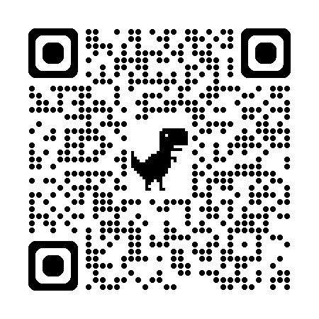

# 🔍 Bài Thực Hành Chương 2 (Phần 2): CANNY EDGE DETECTOR

> Bài thực hành về thuật toán phát hiện cạnh Canny — một trong những thuật toán quan trọng nhất trong Xử lý ảnh và Thị giác máy tính. 

Đặc biệt trong bài thực hành này, ngoài phần lý thuyết và code Python truyền thống, nhóm đã xây dựng thêm một **Web App Chuyên Nghiệp** để trình diễn thuật toán theo thời gian thực!

---

## 📱 Trải Nghiệm Trực Tiếp (Live Demo)

Bạn có thể tự mình trải nghiệm ứng dụng **Canny Edge Studio** ngay trên điện thoại hoặc máy tính bằng cách quét mã QR bên dưới:

<div align="center">
  
  <p><i>Quét để mở ứng dụng Canny Edge Studio</i></p>
</div>

---

## 📁 Cấu trúc thư mục

```text
Lab2_Part2/
│
├── 📄 README.md                     ← Bạn đang ở đây
├── 📄 requirements.txt              ← Danh sách thư viện cần cài
│
├── 📓 Phan1_LyThuyet_Canny.ipynb    ← Phần I: Lý thuyết + Phần III: Câu hỏi mở rộng
├── 📓 Phan2_ThucHanh_Canny.ipynb    ← Phần II: Code thực hành
│
├── 📁 web/                          ← 🌟 SOURCE CODE WEB APP CANNY STUDIO
│   ├── index.html                   ← Giao diện HTML
│   ├── main.js                      ← Logic OpenCV.js xử lý ảnh/camera
│   ├── style.css                    ← CSS Photo Studio Theme
│   └── vite.config.js               ← Cấu hình build server
│
└── 📁 data/
    └── 📁 input/                    ← Chứa các ảnh thực tế (Ví dụ: caubason.jpg...)
```

---

## 🚀 Hướng dẫn cài đặt và chạy (Jupyter Notebook)

### 1. Cài đặt thư viện

Bạn cần cài đặt các thư viện cơ bản phục vụ xử lý ảnh:

```bash
pip install -r requirements.txt
```

**Thư viện sử dụng:**
- `opencv-python`: Xử lý ảnh, `cv2.Canny()`
- `scikit-image`: Cung cấp các thuật toán phụ trợ
- `matplotlib`: Hiển thị ảnh, biểu đồ
- `numpy`: Xử lý mảng số
- `scipy`: Các hàm hỗ trợ như `ndimage.binary_fill_holes()`

### 2. Chuẩn bị ảnh thực hành

1. Tạo thư mục `data/input/` cùng cấp với file notebook.
2. Tải các ảnh bạn muốn thử nghiệm về và lưu vào thư mục `data/input/`.
3. Mở file `Phan2_ThucHanh_Canny.ipynb`, tìm đến các ô chứa hàm đọc ảnh `cv2.imread()` và **đổi tên file** cho khớp với ảnh bạn đã tải.

### 3. Chạy notebook

Mở Jupyter Notebook hoặc VS Code, chạy lần lượt:

1. **`Phan1_LyThuyet_Canny.ipynb`** — Đọc lý thuyết trước
2. **`Phan2_ThucHanh_Canny.ipynb`** — Chạy code thực hành

---

## 🌐 Hướng dẫn chạy Web App (Canny Studio) Local

Nếu bạn muốn chạy Web App trực tiếp trên máy tính của mình thay vì xem qua mạng:

1. Mở Terminal / Command Prompt
2. Di chuyển vào thư mục `web`:
   ```bash
   cd web
   ```
3. Cài đặt các package (cần có sẵn Node.js):
   ```bash
   npm install
   ```
4. Khởi động Vite Server:
   ```bash
   npm run dev
   ```
5. Mở trình duyệt và truy cập vào đường link `http://localhost:5173`. Trình duyệt sẽ hỏi quyền mở Camera (nếu bạn chọn chụp ảnh), hãy nhấn "Allow" (Cho phép).

---

## 📖 Nội dung bài thực hành (Notebook)

### Phần I — Lý thuyết (`Phan1_LyThuyet_Canny.ipynb`)

| Mục | Nội dung |
|:---|:---|
| **1.1** | 5 bước thuật toán Canny: Gaussian Smoothing → Gradient → NMS → Double Threshold → Edge Tracking |
| **1.1b** | Bảng so sánh Canny vs Sobel vs Laplacian |
| **1.2** | Ảnh hưởng tham số: Sigma (σ), ngưỡng thấp (T_low), ngưỡng cao (T_high) |
| **1.3** | Ưu/nhược điểm, ứng dụng thực tế (xe tự lái, y tế, công nghiệp) |

### Phần II — Thực hành (`Phan2_ThucHanh_Canny.ipynb`)

| Bài tập | Nội dung | Kỹ thuật |
|:---|:---|:---|
| **2.1** | Canny bằng OpenCV và Scikit-image | `cv2.Canny()`, `skimage.feature.canny()` |
| **2.2a** | Khảo sát ảnh hưởng Sigma (6 giá trị) | Biểu đồ thống kê pixel cạnh |
| **2.2b** | Khảo sát ngưỡng thấp/cao (6 cặp) | So sánh tỷ lệ 2:1, 3:1, 5:1 |
| **2.2c** | So sánh Canny vs Sobel vs Laplacian | Hiển thị song song 3 phương pháp |
| **2.3a** | Canny trên ảnh nhiễu | `skimage.util.random_noise()` |
| **2.3b** | Canny trên ảnh tương phản thấp | CLAHE (`cv2.createCLAHE()`) |
| **2.4a** | Canny + Phân đoạn ảnh | `cv2.findContours()`, `ndimage.binary_fill_holes()` |
| **2.4b** | Canny + Nhận dạng hình dạng | `cv2.HoughCircles()`, `cv2.approxPolyDP()` |

### Phần III — Câu hỏi mở rộng (`Phan1_LyThuyet_Canny.ipynb`)

| Câu hỏi | Nội dung |
|:---|:---|
| **3.1** | Đánh giá chất lượng cạnh: Precision, Recall, F1, Pratt's FOM |
| **3.2** | Cải thiện Canny: Bilateral Filter, Auto-threshold, Deep Learning (HED) |
| **3.3** | Canny trên ảnh màu: 4 cách tiếp cận (Grayscale, RGB, Lab, Di Zenzo) |

---

## 📊 Kết quả mong đợi

Sau khi hoàn tất bài thực hành này, bạn sẽ:
- ✅ Xây dựng thành công một **Web App xử lý ảnh thực tế**.
- ✅ Hiểu được bản chất toán học của 5 bước thuật toán Canny.
- ✅ Biết cách chọn tham số (Blur, Threshold) phù hợp cho từng điều kiện ảnh cụ thể.

> **Môn học:** Xử Lý Ảnh  
> **Chương:** 2 — Phát hiện cạnh (Edge Detection)  
> **Thuật toán:** Canny Edge Detector (John F. Canny, 1986)
