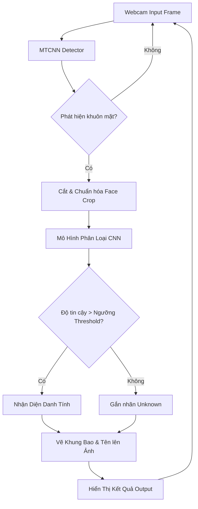

# 📸 Hệ Thống Nhận Diện Khuôn Mặt Thời Gian Thực 

<p align="center">
  
  
  
  
</p>

---

## 🌟 Giới Thiệu (Introduction)

Chào mừng bạn đến với dự án **Nhận diện khuôn mặt thời gian thực (Real-time Face Recognition)**. Dự án này được phát triển trong khuôn khổ bài tập môn học **Xử Lý Ảnh**, sử dụng các công nghệ tiên tiến trong lĩnh vực Computer Vision và Deep Learning.

Hệ thống kết hợp sức mạnh của **MTCNN** (Multi-task Cascaded Convolutional Networks) để phát hiện khuôn mặt với độ chính xác cao và mạng CNN tự huấn luyện (hoặc kết hợp với mô hình **FaceNet**) để trích xuất đặc trưng và nhận diện danh tính trực tiếp qua luồng video từ Webcam.

---

## 🚀 Các Tính Năng Nổi Bật

- **Phát hiện khuôn mặt cực nhạy:** Sử dụng `MTCNN` để tìm và đóng khung khuôn mặt ngay cả trong điều kiện ánh sáng và góc độ khó khăn.
- **Nhận diện thời gian thực:** Xử lý trực tiếp luồng video từ Webcam qua `cv2.VideoCapture`.
- **Deep Learning Pipeline từ A-Z:** 
  - Thu thập và chuẩn hóa dữ liệu trực tiếp qua camera.
  - Xây dựng kiến trúc mạng nơ-ron tích chập (CNN) tùy chỉnh.
  - Huấn luyện, tối ưu và đánh giá mô hình phân loại.
  - Triển khai nhận diện (Inference) theo thời gian thực (Real-time).
- **Giao diện trực quan:** Khung bao (Bounding Box), Tên người dùng và Độ tin cậy (Confidence Score) được hiển thị trực tiếp và rõ ràng trên khung hình video.

---

## 📂 Cấu Trúc Thư Mục

Dự án được tổ chức một cách khoa học để đảm bảo tính rõ ràng, chuẩn chỉnh và khả năng dễ dàng mở rộng, bảo trì:

```text
Image-Processing-Lab/
│
├── README.md                 # Tài liệu giới thiệu và hướng dẫn của dự án (File này)
├── requirements.txt          # Các thư viện phụ thuộc (Dependencies)
├── rules.md                  # Quy tắc hệ thống và hướng dẫn của bài thực hành
│
├── notebook/                 
│   └── Lab5_Webcam.ipynb     # Jupyter Notebook chứa toàn bộ pipeline thực hành và code
│
├── src/                      # Mã nguồn (Source code) tổ chức theo các module chuẩn
│   ├── camera.py             # Module xử lý luồng webcam
│   ├── detector.py           # Module nhận diện và phát hiện vị trí khuôn mặt (MTCNN)
│   ├── embedding.py          # Module trích xuất đặc trưng (Feature extraction)
│   ├── recognizer.py         # Module nhận diện danh tính
│   ├── database.py           # Module quản lý dữ liệu người dùng
│   ├── utils.py              # Các hàm tiện ích hỗ trợ (Utility functions)
│   └── config.py             # Cấu hình các tham số toàn cục của hệ thống
│
├── models/                   # Nơi lưu trữ các mô hình deep learning đã huấn luyện (.h5)
├── dataset/                  # Thư mục chứa dữ liệu hình ảnh (raw, aligned, embeddings)
├── outputs/                  # Thư mục chứa kết quả xuất ra (Video, Screenshots, Logs)
└── docs/                     # Báo cáo, hình ảnh kiến trúc và tài liệu khác
```

---

## 🛠️ Cài Đặt và Môi Trường

### 1. Yêu Cầu Hệ Thống
- **Ngôn ngữ:** Python phiên bản 3.10 trở lên.
- Khuyến nghị sử dụng môi trường ảo (`venv` hoặc `conda`) để cô lập và tránh xung đột thư viện.

### 2. Cài Đặt Các Thư Viện

Mở terminal (Command Prompt/PowerShell/Bash) tại thư mục gốc của dự án và chạy lệnh dưới đây để cài đặt tất cả các thư viện cần thiết:

```bash
pip install -r requirements.txt
```

*Các thư viện chính được sử dụng bao gồm: `opencv-python`, `tensorflow`, `mtcnn`, `numpy`, `matplotlib`, `jupyter`, `Pillow`...*

---

## 🏃 Hướng Dẫn Sử Dụng

Toàn bộ quy trình thực hiện, huấn luyện và nhận diện được tích hợp trực quan bên trong file Jupyter Notebook.

1. **Khởi động môi trường Jupyter:**
   ```bash
   jupyter notebook
   ```
2. **Mở file thực hành chính:**
   Điều hướng giao diện và mở file `notebook/Lab5_Webcam.ipynb`.

3. **Chạy lần lượt các Cell theo kịch bản:**
   - **Bước 1-5:** Khởi tạo môi trường, tải MTCNN và chạy thử nghiệm phát hiện khuôn mặt bằng Webcam.
   - **Bước 6-7:** Thu thập ảnh khuôn mặt của chính bạn từ Webcam để tạo lập tập dữ liệu (Dataset).
   - **Bước 8-10:** Khởi tạo kiến trúc mạng CNN, tiến hành huấn luyện mô hình với tập dữ liệu vừa tạo và lưu lại trọng số (`.h5`).
   - **Bước 11-14:** Kích hoạt luồng Webcam thực tế để Inference. Mô hình sẽ chạy nhận diện, phân loại và hiển thị tên bạn cùng với Bounding Box ngay trên luồng video!

> **Lưu ý Quan Trọng:** Đảm bảo máy tính của bạn đã kết nối Webcam và bạn đã cấp quyền truy cập Camera cho Python/Jupyter Notebook. Để kết thúc chương trình nhận diện thời gian thực, hãy chọn cửa sổ camera OpenCV và nhấn phím `q`.

---

## 🧠 Tổng Quan Luồng Xử Lý (Workflow)



---

## 📚 Tài Liệu Tham Khảo

- [OpenCV Python Documentation](https://docs.opencv.org/)
- [TensorFlow & Keras API](https://www.tensorflow.org/)
- [MTCNN Github Repository](https://github.com/ipazc/mtcnn)
- [FaceNet: A Unified Embedding for Face Recognition](https://arxiv.org/abs/1503.03832)

---
*Được thiết kế chuẩn mực phục vụ học tập, nghiên cứu và phát triển hệ thống Thị Giác Máy Tính.*
